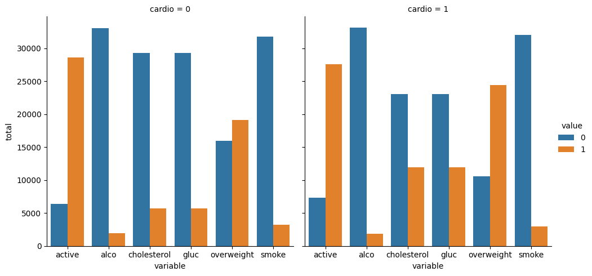
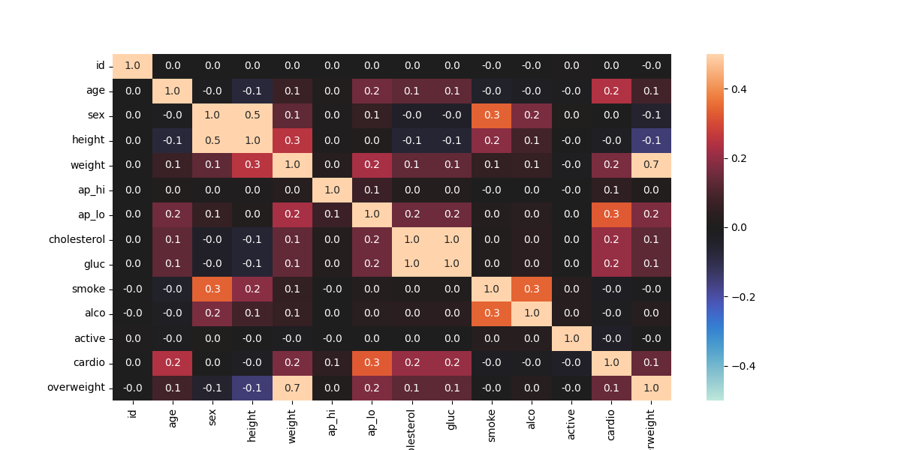

# Project: Medical Data Visualization

This project is part of the **freeCodeCamp Data Analysis with Python** course. The goal is to analyze and visualize medical examination data to explore the relationships between cardiac disease, body measurements, blood markers, and lifestyle choices. The dataset contains various health metrics for patients, and the visualizations will help in understanding patterns in cardiac health.

## Project Overview

In this project, we work with a dataset containing patient information from medical examinations. The data includes features like cholesterol levels, glucose levels, alcohol consumption, and smoking habits, which are used to examine the relationships between lifestyle factors and cardiac disease.

### Key Visualizations:
1. **Categorical Plot**: Displays the counts of good and bad outcomes for cholesterol, glucose, alcohol consumption, smoking, activity levels, and overweight status.
2. **Heatmap**: Shows the correlation between all features in the dataset.

## Requirements

The following libraries are required to run the project:
- **Pandas**: Data manipulation and cleaning.
- **Matplotlib**: Visualization of data using bar plots and heatmaps.
- **Seaborn**: For enhanced visuals in the categorical plots and heatmap.
- **NumPy**: Used for masking the correlation matrix.

You can install these libraries using pip:

```bash
pip install pandas matplotlib seaborn numpy
```

## Files
- **medical_examination.csv**: The dataset containing medical data from patient examinations.
- **catplot.png**: Categorical plot showing lifestyle choices and health metrics split by cardiac health status.
- **heatmap.png**: Heatmap showing the correlation between different medical and lifestyle variables.

## Code Overview

### Data Preprocessing
1. **BMI Calculation and Overweight Column**: 
- Body Mass Index (BMI) is calculated by dividing a person’s weight (in kg) by the square of their height (in meters). If the BMI is greater than 25, the person is considered overweight.
- A new `overweight` column is created, where a value of 1 represents an overweight person and 0 represents someone who is not overweight.

2. **Normalization**:
- Cholesterol and glucose levels are normalized, where 0 represents a healthy value and 1 represents a value that indicates a health risk.

3. **Data Cleaning**:
- The data is cleaned by filtering out patients whose diastolic blood pressure is higher than systolic, or those whose height and weight are outside the 2.5th and 97.5th percentiles.

### 1. Categorical Plot
The `catplot()` function is used to create a bar chart comparing the counts of good and bad outcomes for variables such as cholesterol, glucose, alcohol consumption, smoking, physical activity, and overweight status. The plot is split into two panels: one for patients with cardiovascular disease (`cardio=1`) and one for those without (`cardio=0`).

### 2. Heatmap
A **correlation matrix** is calculated to show the relationships between the various features. A heatmap is created using Seaborn's `heatmap()` function, with the upper triangle of the matrix masked to focus on the relevant part of the correlation. The plot is annotated to highlight the strength of the correlations.

## How to Run
1. Clone this repository to your local machine.
2. Install the required libraries.
3. Place the dataset file (`medical_examination.csv`) in the same directory as the script.
4. Run the Python script to generate the visualizations:
```bash
python medical_data_visualizer.py
```
5. The visualizations will be saved as `.png` files.

## Example Plots

- **Categorical Plot**  


- **Heatmap**  


## Conclusion
This project provides insight into how various lifestyle choices and body measurements correlate with cardiac disease. By visualizing the data, we can better understand the relationships between health metrics and outcomes, which can guide further analysis or medical decision-making.
